# 人工神经网络HW4报告

吴明恒  2018011288 计81

## VAE

#### 训练曲线

##### Latent dim为3

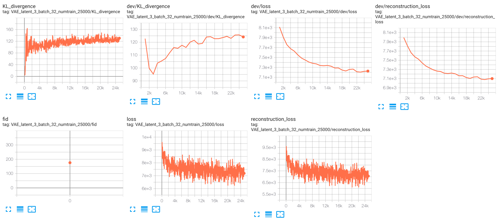

##### Latent dim为10

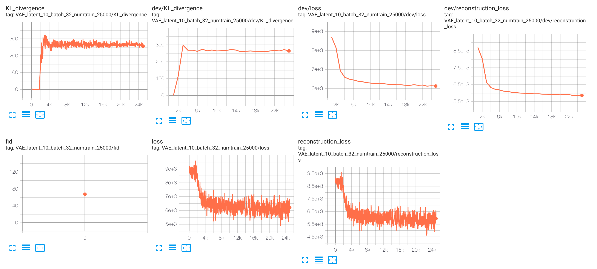

##### Latent dim为64

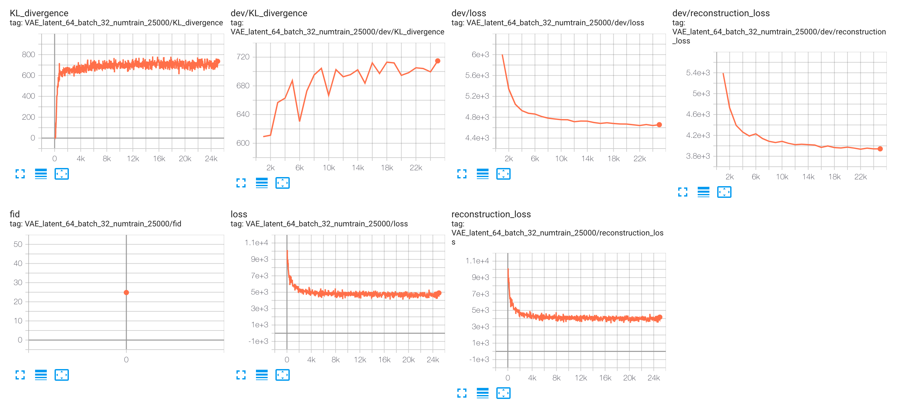


##### Latent dim为100

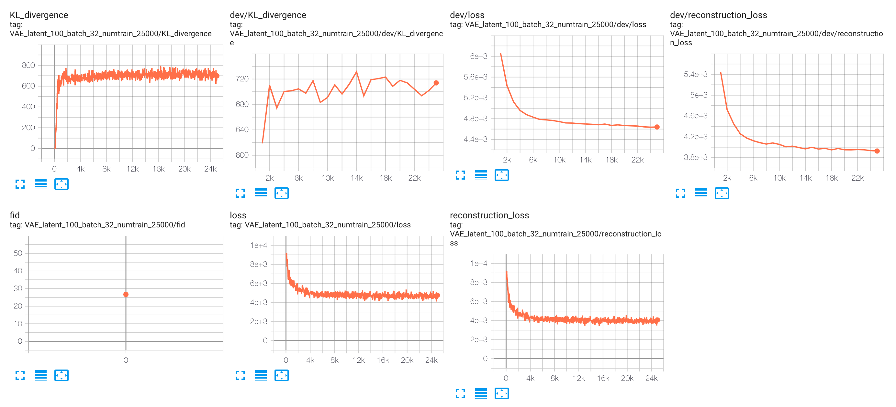

#### 生成图像质量

##### Latent dim 为3

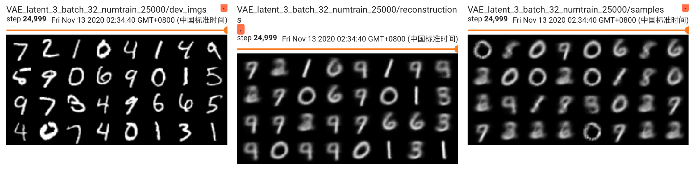

##### Latent dim 为10

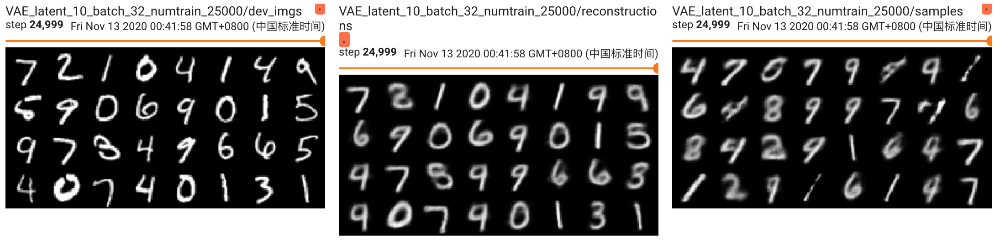

##### Latent dim 为64

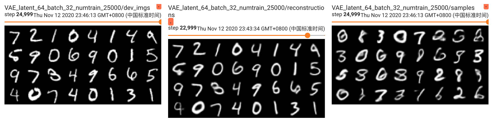

##### Latent dim 为100

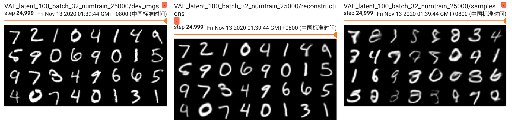

#### FID

| latent dim |    FID    |
| :--------: | :-------: |
|     3      |   176.2   |
|     10     |   67.46   |
|     64     | **24.84** |
|    100     |   26.65   |


#### Latent dim的影响

直观来看，当latent dimension过小时，效果并不好，而当它增大到一定值时，再增加latent dimension反而会使效果变差。

Latent dimension决定了学习出的用于表示图像特征的向量空间大小，过小时特征的区分能力不足，过大时容易陷于某些细节特征。

#### Optional 尝试不同的结构

调整VAE的Encoder与Decoder，将其变为两层的MLP。

```python
Encoder:
nn.Linear(in_features=16 * 8 * 8, out_features=400), nn.ReLU()
nn.Linear(in_features=400, out_features=latent_dim * 2), nn.ReLU()
Decoder:
nn.Linear(in_features=latent_dim, out_features=400), nn.ReLU()
nn.Linear(in_features=400, out_features=32 * 32), nn.Sigmoid()
```

实验结果如下：

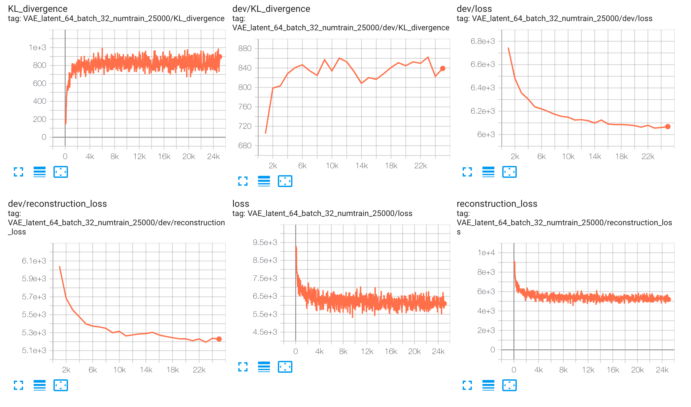

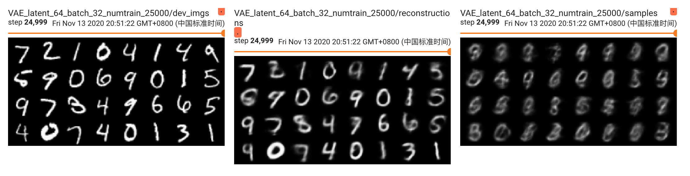

| latent dim |    Type     |  FID  |
| :--------: | :---------: | :---: |
|     64     | All-Linear  | 139.6 |
|     64     | Conv-Linear | 24.84 |

可以看出全连接相比卷积在提取图像特征方面的劣势，同时此全连接网络的层数也更少，因此效果较差，产生的图像几乎没有可以辨识的。

## GAN

#### 训练曲线

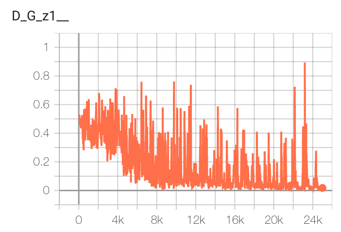

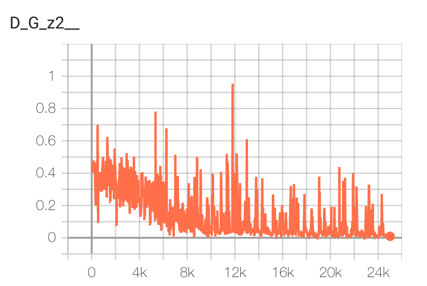

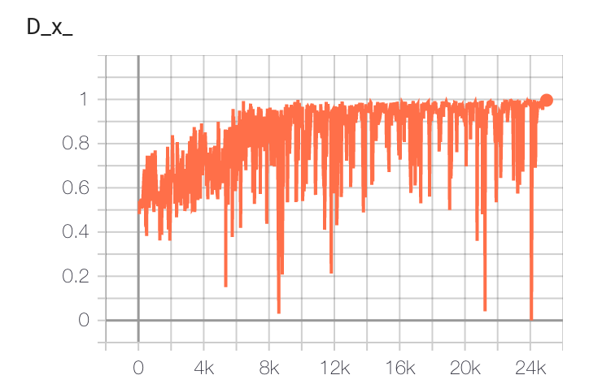

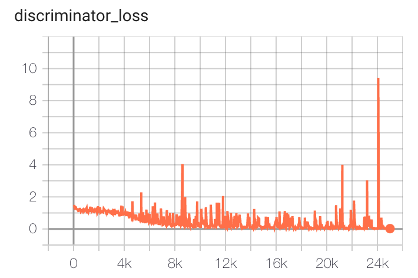

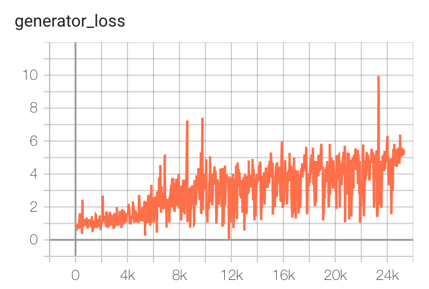

#### 图像

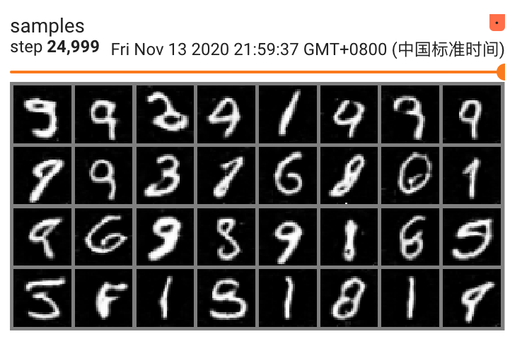

#### FID

| latent dim | Type |  FID  |
| :--------: | :--: | :---: |
|    100     | VAE  | 26.65 |
|    100     | GAN  | 53.92 |

#### 纳什均衡

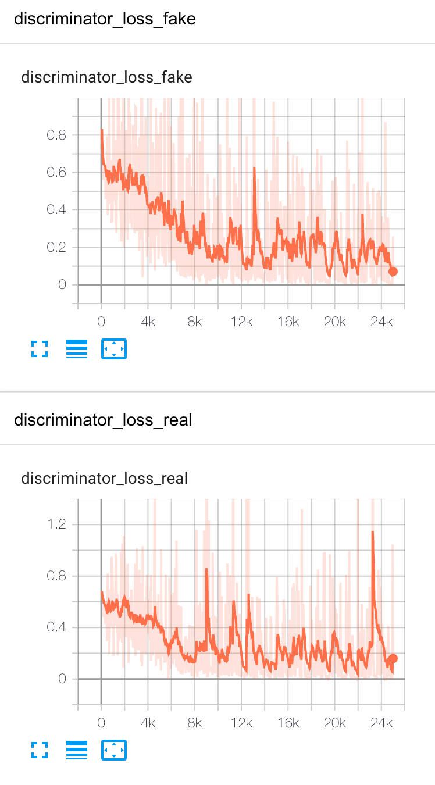

基本达到纳什均衡，看上方的图像，即判别器对真实图像与伪造图像的判别，没有显著差距，都处在说明GAN不能有效区分true img与fake img。

纳什均衡不一定是可以产生以假乱真的图像的，它指生成与判别达到了一种平衡，所以生成质量与判别器的关系也很大，如果判别器训练的不够好，也可以达到纳什均衡，但实际上生成图像质量并不高。

#### 与VAE的对比

通过图像我们可以看出VAE产生的图像要更模糊一些，但是FID分数更高。

VAE要通过Encoder生产出含有图像主要特征的一个低维向量，但是在实际图像中往往含有大量的高频细节信息（纹理信息），这些信息要通过一个低维的向量全部表示时不现实的，所以VAE可能会倾向于生产出一张比较平均的图片，而目标图像中比较sharp的部分很可能会被平均掉。

GAN相比VAE一个重大区别是没有显式定义的判别式直接对图像进行判别，而是采用神经网络，这是它比VAE边缘清晰的主要原因。

#### Interpolation

对模型做两个随机隐向量之间的插值，并生成一系列图像：

GAN：

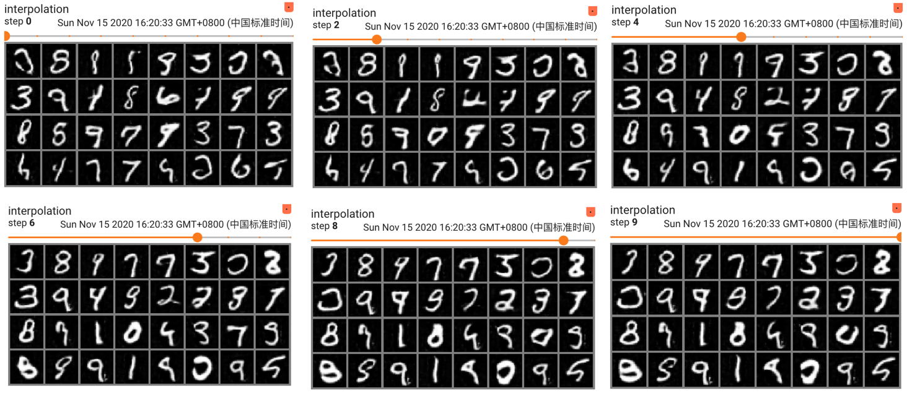

VAE：

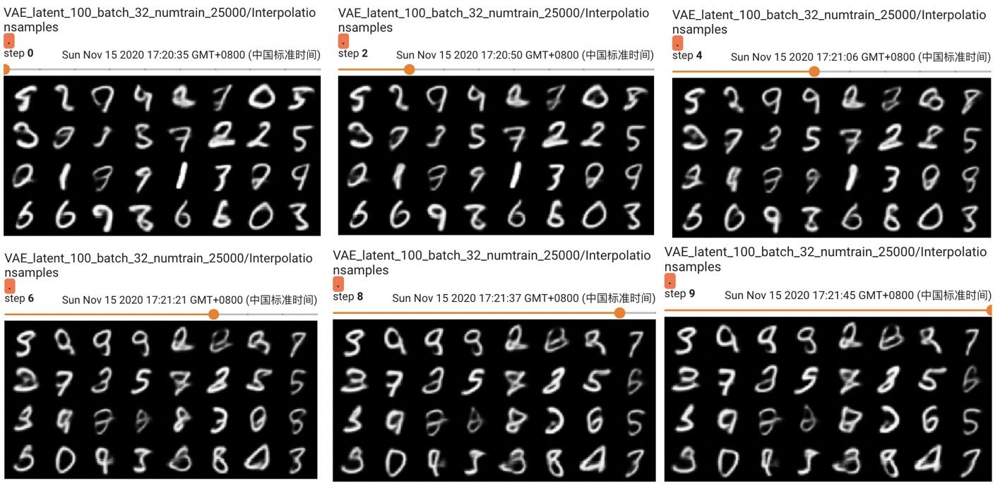

可以看出VAE与GAN都有一定的隐向量表示图像特征的能力，在线性插值变换的过程中，GAN生成的图像较VAE的图像边缘更为清晰，但产生的图像形状不明显。

#### Optional hidden dimension参数的影响

| generator_hidden_dim | discriminator_hidden_dim |  FID  |
| :------------------: | :----------------------: | :---: |
|          4           |            4             | 98.65 |
|          8           |            8             | 52.00 |
|          16          |            16            | 53.92 |
|          32          |            32            | 84.17 |
|          64          |            64            | 76.70 |

当判别器与生成器的hidden dimension过小与过大时均会对模型产生负面影响，从FID来看8~16是一个比较合理的值。

以hidden dim = 4时的生成图像为例：

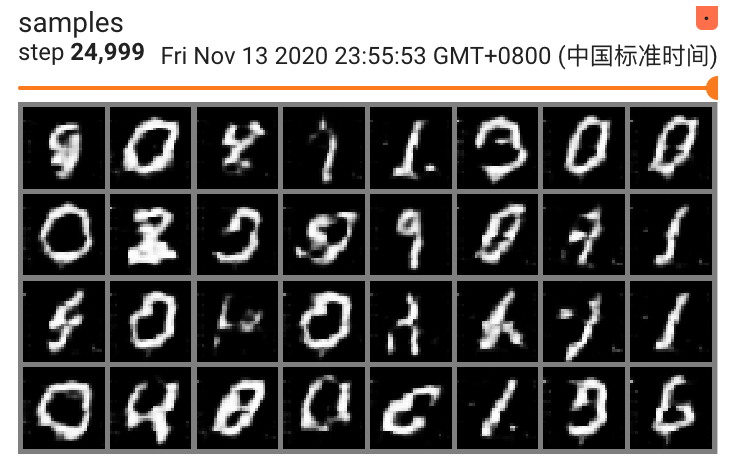

此时模型无法提取与识别出合理的图像特征，可能是参数的限制导致的，生成的图像质量很低。


